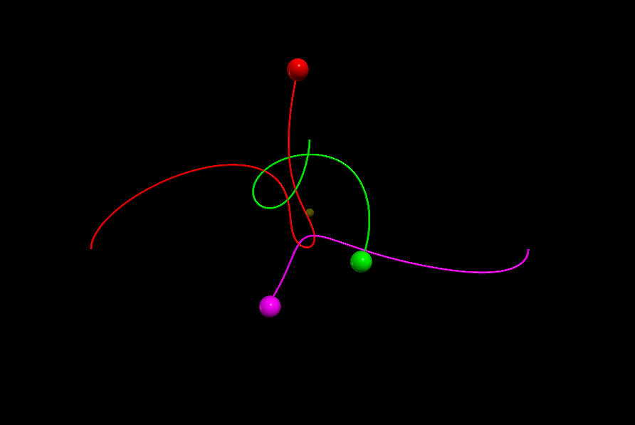
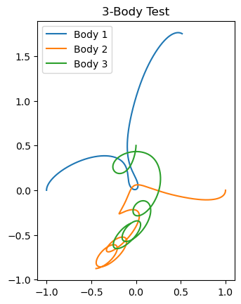
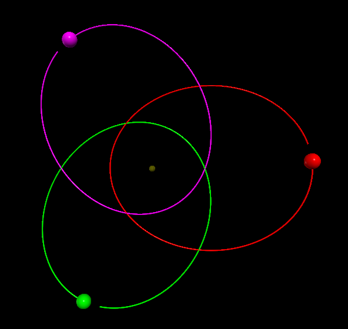
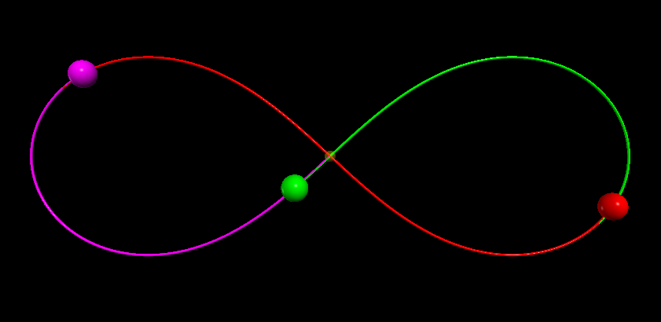

# The Three Body Problem Simulation & Statistical Analysis
## The Challenge

Simulating three bodies under mutual gravitational attraction reveals fundamental problems in classical mechanics:

1. **No exact solution exists** - unlike 2-body systems
2. **Chaotic behavior** - small errors grow exponentially
3. **Numerical stability** - integration methods must conserve energy and momentum

## Goals of this project

- Implement accurate numerical integration (Velocity Verlet)
- Maintain conservation laws (center of mass, energy)
- Visualize the Three Bodies using matplotlib and rendering engines ( Panda3d )
- Document problems encountered and solutions found

## Where do we start?
Strictly we are only calculating **Three Bodies** nothing more nothing less, and since we trying to visualize it in 3d it makes things complicated, Each body now will move in the **X,Y and Z axis**. The way I Approached this is by making a class thats receives the **Position(r)** , **Velocity(v)** and **Mass(m)**, which leaves the **Force** and **Acceleration** we Zero those.
```python
class CelestialBodies:
    def __init__(self,r,v,m):
            self.r = r.copy()
            self.v = v.copy()
            self.m = m
            self.a = np.zeros(3)
            self.f = np.zeros(3)
```

Now we have to calculate The **Force** using Law of Universal Gravitation:


Where:
- G = gravitational constant
- m₁, m₂ = masses of two bodies
- r = distance between them
```python
# Force from body 1 on current body (X-component)
self.f[0] += G*(self.m*obj1.m/math.pow(rAB,3))*(obj1.r[0]-self.r[0])
# Force from body 2 on current body (X-component)
self.f[0] += G*(self.m*obj2.m/math.pow(rAC,3))*(obj2.r[0]-self.r[0])
# (Y and Z components calculated similarly)
```

### Calculating And Updating Using Velocity Verlet
Before Using the Velocity Verlet I tried using the Euler Method but I got mediocre results. So what is Velocity Verlet? It's a method used to integrate newtons equations of motion, and mostly used in Physics simulations and Trajectory calculations.

It has 4 Stages:
1.  Calculating Old Acceleration
2.  Position Update
3.  Calculating New Acceleration
4.  Velocity Update


## Application

In the simulation loop, the Velocity Verlet is applied to **all three bodies simultaneously** — this is critical. You cannot update one body fully before updating the others, because the forces at time `t + dt` must be computed using the new positions of **all** bodies together.

The loop runs in **4 phases**:

**Phase 1 — Compute old accelerations at time t:**
```python
b11.Force(b22, b33); a1_old = b11.f / b11.m
b22.Force(b11, b33); a2_old = b22.f / b22.m
b33.Force(b11, b22); a3_old = b33.f / b33.m
```

**Phase 2 — Update all positions:**
```python
b11.r += b11.v*time + 0.5*a1_old*time**2
b22.r += b22.v*time + 0.5*a2_old*time**2
b33.r += b33.v*time + 0.5*a3_old*time**2
```

**Phase 3 — Compute new accelerations at time t + dt (using updated positions):**
```python
b11.Force(b22, b33); a1_new = b11.f / b11.m
b22.Force(b11, b33); a2_new = b22.f / b22.m
b33.Force(b11, b22); a3_new = b33.f / b33.m
```

**Phase 4 — Update all velocities:**
```python
b11.v += 0.5*(a1_old + a1_new)*time
b22.v += 0.5*(a2_old + a2_new)*time
b33.v += 0.5*(a3_old + a3_new)*time
```

## Softening Parameter

One issue encountered was **division by zero** (or near-zero) when two bodies come extremely close together. To fix this, a small epsilon `eps` is added to the distance calculation:
```python
eps = 1e-5
rAB = math.sqrt((obj1.r[0]-self.r[0])**2 + ...) + eps
```

This prevents the force from blowing up during close encounters. It's a standard trick in N-body simulations known as **gravitational softening**.

## Initial Conditions

The behavior of the simulation is entirely determined by the starting positions and velocities of the three bodies. We tested three configurations:

### Random Test
A simple asymmetric setup to observe chaotic behavior:
```python
b11 = CelestialBodies(r=np.array([-1.0, 0.0, 0.0]), v=np.array([0.0,  0.3, 0.0]), m=1.0)
b22 = CelestialBodies(r=np.array([ 1.0, 0.0, 0.0]), v=np.array([0.0, -0.3, 0.0]), m=1.0)
b33 = CelestialBodies(r=np.array([ 0.0, 0.5, 0.0]), v=np.array([0.0,  0.0, 0.0]), m=1.0)
```


This setup quickly becomes chaotic — the third body gets ejected or produces irregular orbits.

### Equilateral Triangle
Three bodies placed symmetrically at 120° intervals:
```python
b11 = CelestialBodies(r=np.array([ 1.0,  0.0,   0.0]), v=np.array([ 0.0,   0.5,  0.0]), m=1.0)
b22 = CelestialBodies(r=np.array([-0.5,  0.866, 0.0]), v=np.array([-0.433,-0.25, 0.0]), m=1.0)
b33 = CelestialBodies(r=np.array([-0.5, -0.866, 0.0]), v=np.array([ 0.433,-0.25, 0.0]), m=1.0)
```


### Figure-8 (Famous Periodic Solution)
All three bodies follow the same figure-8 path with a 120° phase offset:
```python
b11 = CelestialBodies(r=np.array([-0.97000436,  0.24308753, 0.0]), v=np.array([ 0.466203685,  0.43236573, 0.0]), m=1.0)
b22 = CelestialBodies(r=np.array([ 0.0,          0.0,        0.0]), v=np.array([-0.93240737,  -0.86473146, 0.0]), m=1.0)
b33 = CelestialBodies(r=np.array([ 0.97000436,  -0.24308753, 0.0]), v=np.array([ 0.466203685,  0.43236573, 0.0]), m=1.0)
```



One of the rare **periodic, stable** solutions to the three-body problem.

## Visualization with VPython

Each body is a `sphere` with a trail to trace its path:
```python
ball_1 = sphere(pos=vector(b11.r[0], b11.r[1], b11.r[2]),
                radius=0.05, color=color.red,
                make_trail=True, trail_radius=0.005, retain=2000)
```

A **yellow sphere** marks the **center of mass** as a conservation check:
```python
com_pos = (b11.m*b11.r + b22.m*b22.r + b33.m*b33.r) / total_mass
com.pos = vector(com_pos[0], com_pos[1], com_pos[2])
```

## Problems Encountered

| Problem | Cause | Solution |
|---|---|---|
| Bodies fly off to infinity | Euler method accumulates error | Switched to Velocity Verlet |
| Division by zero crash | Bodies pass through same point | Added softening `eps = 1e-5` |
| Choppy animation | `rate()` too low | Increased to `rate(100)` |
| Figure-8 drifting over time | Floating point error accumulation | Reduced time step to `0.0008` |

## Results

- The **random test** produced chaotic trajectories — small changes in initial velocity led to completely different outcomes after only a few hundred steps
- The **equilateral triangle** held its shape briefly before slowly breaking symmetry due to floating point rounding
- The **figure-8** remained stable for the full `50,000` steps, confirming the integrator was accurate enough for this known periodic orbit


# Statistical Analysis

### Energy Conservation

A key indicator of integrator accuracy is whether **total mechanical energy** stays constant over time. Total energy is the sum of kinetic and potential energy across all three bodies:

**Kinetic Energy:**
```python
KE = 0.5*m1*|v1|² + 0.5*m2*|v2|² + 0.5*m3*|v3|²
```

**Potential Energy:**
```python
PE = -G*(m1*m2/r12) - G*(m1*m3/r13) - G*(m2*m3/r23)
```

### Observations

- **Velocity Verlet** keeps energy drift very small over 50,000 steps compared to the Euler method
- Any small oscillation is expected — Velocity Verlet conserves energy *on average*, not exactly at every step
- A growing drift would signal the time step `dt = 0.0008` is too large
- The **figure-8** configuration shows the flattest energy curve due to its periodic nature
- The **random test** shows the most drift, consistent with its chaotic behavior

## Prototype & Development

### First Prototype (Jupyter Notebook)

Before building the VPython visualization, the first prototype was written in a **Jupyter Notebook** using **matplotlib** for 2D plotting. This version was used to verify the physics before adding the 3D rendering layer.

Key differences from the final version:

| | Prototype | Final Version |
|---|---|---|
| Visualization | matplotlib 2D | VPython 3D |
| Steps | 20,000 | 50,000 |
| Time step | 0.0002 | 0.0008 |
| Tracking | x, y only | x, y, z |
| COM check | printed every 1000 steps | rendered live as yellow sphere |

The prototype also included a **center of mass drift check** printed every 1000 steps:
```python
if _ % 1000 == 0:
    total_mass = b1.m + b2.m + b3.m
    com = (b1.m*b1.r + b2.m*b2.r + b3.m*b3.r) / total_mass
    print(f"Drift from origin: {np.linalg.norm(com)}")
```

This confirmed that momentum was being conserved — the drift value stayed near zero throughout the simulation, validating the Velocity Verlet implementation before moving to the full 3D version.

### Development Process

1. **Euler Method** — first attempt, bodies flew off to infinity due to error accumulation
2. **Velocity Verlet in Jupyter** — stable results, confirmed with matplotlib 2D plots and COM drift checks
3. **VPython Migration** — moved to 3D visualization with live rendering and trail history